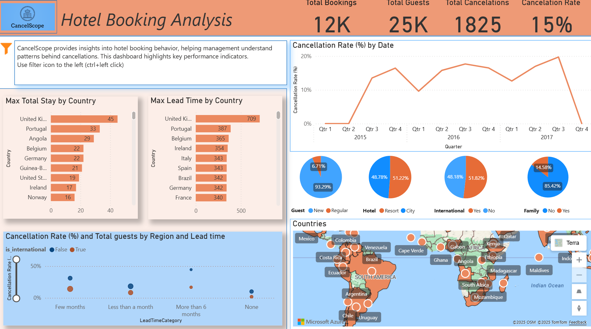
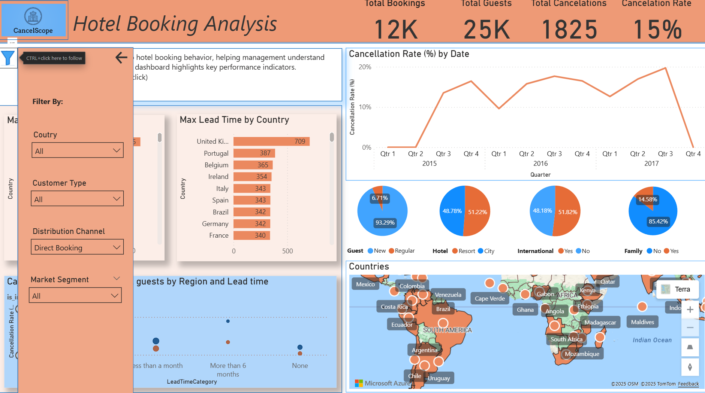
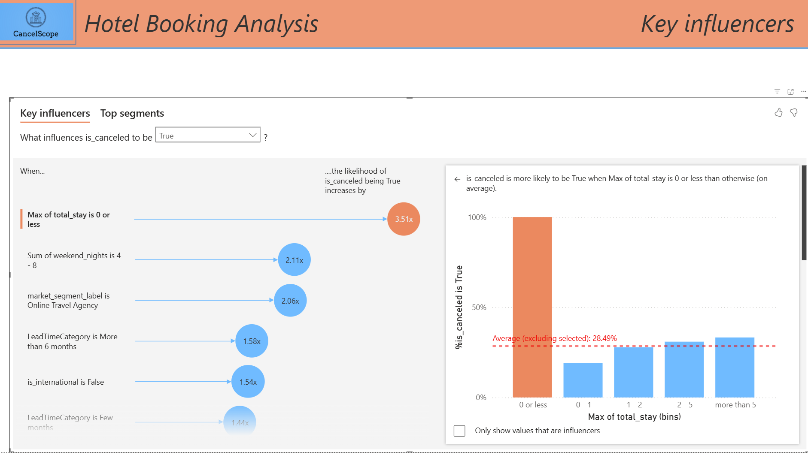
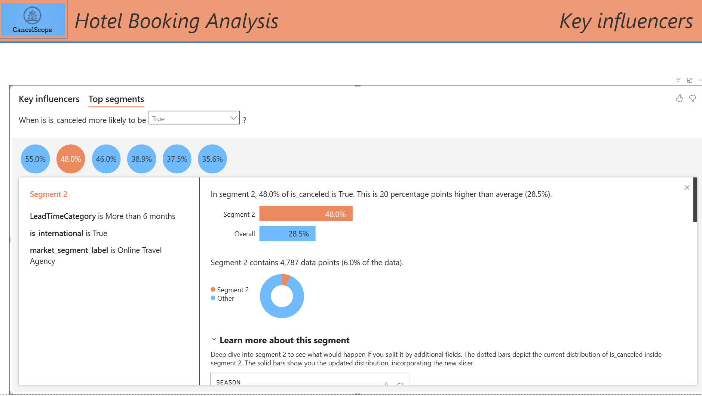
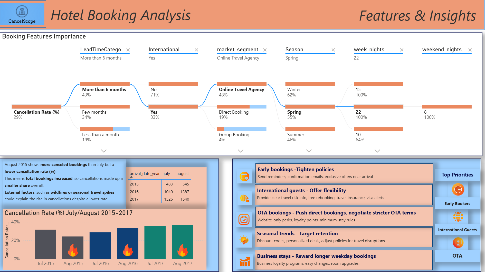
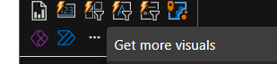
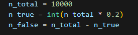
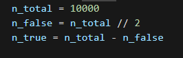
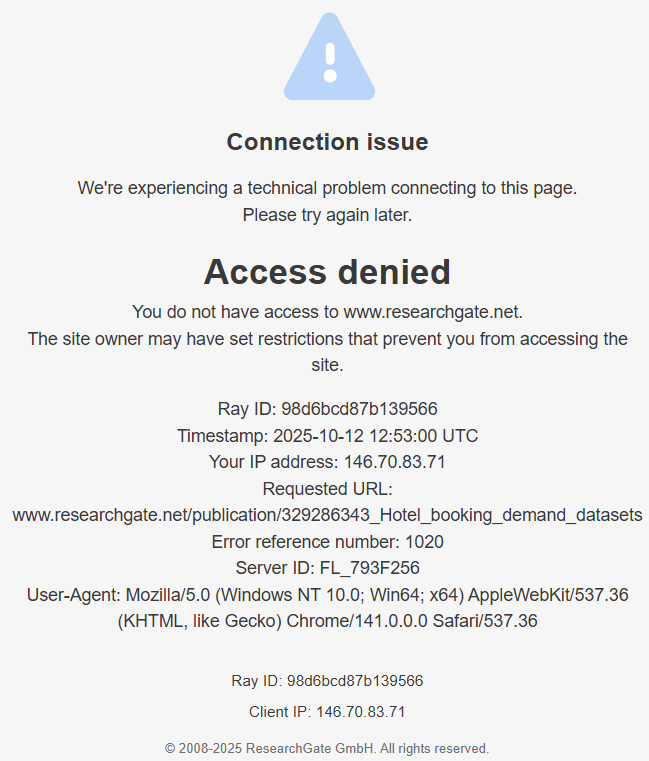
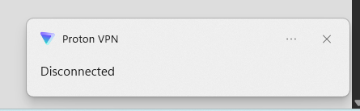

<h1 align="center">CancelScope - Hotel Booking Analysis</h1>

**CancelScope** analyzes hotel booking records to identify the key drivers of reservation cancellations and recommend actions to reduce churn. It combines exploratory data analysis and predictive modeling to produce clear visualisations and an interactive dashboard for hotel managers.

	

## Dataset Content
* Link to download dataset: [Kaggle Dataset](https://www.kaggle.com/datasets/mathsian/hotel-bookings/data?select=hotel_bookings.csv)
* Data set contains the information on 119,390 hotel bookings between 1st of July of 2015 and the 31st of August 2017
* Both hotels are located in Portugal: the Resort Hotel is in the region of the Algarve and the City Hotel is in the city of Lisbon
* The original raw data set is given in the hotel_bookings.csv file. This is the file that is downloaded for analysis in the current project. It consists of 32 columns

## Business Requirements
To better understand the factors that influence hotel booking cancellations, the company has to conduct a data-driven investigation.  The goal is to investigate customer and booking characteristics,such as lead time, market sector and guest origin, in order to discover potential causes of cancellation behaviour.  This information will help business to make more informed decisions about reservation policies and customer management.

## Hypothesis and how to validate?

**Hypothesis 1: Lead Time vs. Cancellation**
- H0: There is no relationship between lead time and the likelihood of booking cancellation
- H1: Longer lead times are associated with a higher likelihood of booking cancellation
- Rationale: Customers who book far in advance may have a higher chance of changing their plans or finding alternative options
- How to Test:chi-square test, compare mean lead time between canceled and non-canceled bookings using a t-test,visualize with boxplots or histograms for canceled vs. non-canceled bookings

**Hypothesis 2: Deposit Type vs. Cancellation**
- H0: Cancellation rates are independent of the type of deposit
- H1: Bookings with refundable or no deposit have higher cancellation rates than non-refundable deposits
- Rationale: A higher financial commitment (non-refundable deposit) discourages cancellations, while refundable or no-deposit bookings are easier to cancel
- How to Test: chi-square test of independence between deposit_type and is_canceled, calculate cancellation rates per deposit type, visualize with a bar chart showing percentage canceled per deposit type

**Hypothesis 3: Customer Type vs. Cancellation**
- H0: Customer type (transient, group, contract, transient_party) does not affect the probability of cancellation
- H1: Certain customer types (e.g., transient guests) have higher cancellation rates than others (e.g., contract clients)
- Rationale: Groups or contract clients are more committed to their bookings, while individual or transient guests may cancel more frequently
- How to Test:chi-square test for independence between customer_type_label and is_canceled, compute cancellation rates per customer type,visualize with stacked bar charts to compare cancellation percentages across customer types

**Hypothesis 4: Family vs. Cancellation**
- H0: Being a family booking (is_family) does not affect the likelihood of cancellation
- H1: Family bookings are less likely to be canceled compared to non-family bookings
- Rationale: Families often plan stays in advance and are less likely to cancel compared to individual or transient guests
- How to Test: chi-square test of independence between is_family and is_canceled, calculate cancellation rates for family vs. non-family bookings,visualize with bar plots showing the proportion of cancellations for families vs. non-families

## Project Plan
The project follows a structured approach to explore and model hotel booking cancellations. Each stage focuses on maintaining data quality and ensuring reliable analytical outcomes.

Steps:
- Collect and import the dataset for analysis
- Clean and transform the data to handle missing or inconsistent values
- Engineer new features to capture booking and customer characteristics
- Save the clean data for EDA and dashboard visualizations. The full dataset is used for exploratory data analysis and dashboard creation to ensure that all available information is represented and that trends, patterns and seasonal variations are accurately captured
- Save a balanced and randomized sample of 10,000 records for machine learning. This reduces computational load and improves processing efficiency while maintaining a representative subset of the data—balancing performance, scalability and analytical reliability
- Perform exploratory data analysis to identify key patterns and correlations
- Split the sampled data into training and testing sets for model development
- Build and evaluate predictive model to understand cancellation drivers
- Build a Power BI dashboard to interpret and visualize findings to support business decisions

## The rationale to map the business requirements to the Data Visualisations
The Power BI dashboard maps each business requirement to targeted data visualisations, interactive menus and filters, ensuring that decision-makers gain actionable insights into all areas of hotel booking operations, along with relevant external events
- Monitor booking and cancellation performance: KPI cards and trend charts present real time metrics for quick assessment
- Analyze booking lead times and regions: Bar charts, maps, tree map highlight where bookings come from, how far in advance they are made, and the relative size of different market segments or countries
- Identify drivers of cancellations: Influencer and segment analysis reveal which factors most impact cancellations
- Highlight external events: Dedicated visuals indicate when wildfires occurred, providing important context for interpreting booking and cancellation trends
- Enable flexible exploration: Interactive menus and filters allow users to focus on specific market segments, guest types, or regions for a customized view
- Deliver actionable insights: Summary sections provide focused recommendations based on the data

## Analysis techniques used
- The data analysis process began with thorough ETL procedures. Data was imported from Kaggle, duplicates and missing values were removed, irrelevant or post-hoc features were dropped, and new features were engineered (e.g., total_stay, is_family, cancellation_ratio). Outliers were investigated and retained if deemed valid(group bookings, very long leading times etc)
- EDA included summary statistics (mean, median, standard deviation), correlation heatmaps, distribution plots, and hypothesis testing (t-tests, chi-square tests) to examine relationships between key variables and cancellations. Categorical and numerical analyses were performed to guide further modeling and business recommendations
- A Random Forest Classifier was trained to predict cancellations. Data was split into training and test sets and the model was evaluated using metrics such as accuracy, ROC-AUC, precision, recall and F1-score. Threshold analysis was conducted to optimize recall for the business goal. Feature importance was reviewed and cross-validation was performed to validate the model's stability
- Interactive dashboards were developed for business users, featuring KPI cards, bar charts, line charts, maps, tree map and filters/menus. The dashboard delivers actionable insights on booking trends, cancellations, lead times, geographic patterns and the context of external events such as wildfires

**Structure and justification**
The analysis was structured to follow a logical and end-to-end data analysis workflow:
ETL: Ensured high-quality, relevant data for all subsequent steps. Also, every decision that was made, followed a clearly explained logic and justification
EDA: Provided a comprehensive understanding of the dataset structure and relationships and informed feature selection and hypothesis generation.
ML Modeling: Leveraged insights from EDA to build and optimize a predictive model with a focus on recall to match business priorities
Dashboarding: Translated technical findings into business-friendly visuals, allowing users to interactively explore the data and interpret results.
This structure ensures that each phase builds upon validated, cleaned data and that findings remain reproducible and actionable

**Data limitations and alternative approaches**
- While the dataset only covers bookings from July 2015 to August 2017—making 2016 the only complete year—the time-based visualizations such as the line chartt comparing cancellation rates over time remain valuable for identifying trends and patterns within the available period. This help uncover seasonal behaviors, fluctuations in cancellations and other temporal dynamics that contribute to a deeper understanding of booking trends. To add further context, I also conducted research into real-world force majeure events that may have influenced customer behavior during the observed timeframe. For instance, wildfires occurred in August 2015, 2016, and 2017—periods that align with increased cancellation activity and are referenced in both the dashboard and recommendations ("adjust policies for travel disruptions"). Additionally, airport strikes in December 2016 were identified as another relevant force majeure event and were considered when developing recommendations, even though only December 2015 and 2016 are represented in the data and not explicitly represented in a chart. By combining the available booking information with external contextual factors, the analysis provides a more comprehensive and realistic interpretation of hotel cancellation patterns.
- Some variables contained high proportions of missing or non-informative values (agent, company) which were dropped to avoid bias.
- Where categorical features were too sparse or not meaningful, feature engineering (such as is_family, cancellation_ratio, and is_international) provided more robust predictors
- Outliers were reviewed in context (group bookings, long lead times) and retained when valid rather than removed indiscriminately to avoid unnecessary data loss
- Visualization and analysis strategies were adapted to highlight periods with consistent data coverage and to provide appropriate context when interpreting trends across years

**AI tools** such as Copilot and ChatGPT were helpful in summarizing my notes and generating clearer lists and steps, as my preliminary plans and ideas were mostly in a rough notepad blueprint. Copilot, integrated in VS Code, assisted with code optimization and with creating a script to resize the image used in my README file. I also used Copilot to generate labels in the ETL notebook, which saved significant time that would otherwise have been spent looking up country abbreviations, names, and business terminology ('ta_to': 'Travel Agent/Tour Operator'). For the dashboard creation, I leveraged ChatGPT to write DAX formulas, which further optimized and accelerated my workflow throughout the project. Additionally, AI tools provided guidance throughout the machine learning workflow, helping me choose suitable approaches and interpret the results more effectively.

## Ethical considerations
There were no data privacy, bias or fairness concerns with the dataset. According to the dataset description on Kaggle: “all data elements pertaining to hotel or customer identification were deleted”, ensuring that **privacy was maintained.**

## Dashboard Design - pages and content
**Page 1: Overview & Key Metrics**

- KPI cards (total bookings, total cancellations, etc.)
- Bar charts: Max Lead Time by Country, Max total stay by country
- Line chart: Cancellation Rate by Date
- Azure Map: Bookings and cancellations by country
- Scater chart: Cancelation rate and total guests by region and lead time
- Filter by: Country, customer type, distribution channel, market segment
- Pie-charts: Guest type, Hotel type, International or not, Family or not

  
  

**Page 2: Key Influencers of Cancellations - AI-powered visual**
- Key Influencer visual: Identifies factors with the strongest impact on cancellations
- Bar chart: Likelihood of cancellation by guest segment, stay duration, and other features
- Top segments panel: Shows which groups are most likely to cancel
- Interactive filters: Refine segment analysis by selecting specific variables

  
  

**Page 3: Features & Insights**

- Decomposition tree (AI-powered visual), breaks down the key metric Cancellation % into its contributing factors step by step
- Bar chart: only for July & August 2015, 2016, 2017 for better comparability, also includes months with registered wildfires
- Table showing the number of the cancelations for the same months
- Communication of Data Insights
- Recommendations and highligting top priorities

  

The dashboard was designed to communicate complex data insights in a way that is accessible to everyone. For non-technical audiences it uses clear visuals like KPI cards, simple bar and line charts, and color coding to highlight important trends and figures. For technical audiences, it includes deeper analysis tools such as decomposition trees and key influencer charts, allowing them to drill down into the data and explore underlying patterns. Interactive filters and menus let all users customize their view, making it easy to find relevant information regardless of their background or expertise.

**Note: The final dashboard differs from the original wireframe due to changes and new ideas implemented during development.**

## Unfixed Bugs and challenges
At the time of completing this section, there were no identified unresolved bugs. During the development process, I encountered some technical issues. The first occurred at the beginning of the Power BI dashboard creation, when I attempted to use a custom map visual downloaded from the “Get more visuals” menu. After installing it, Power BI froze and repeatedly crashed upon reopening. To resolve this, I started a new project, removed the problematic map visual, and the issue was successfully fixed, but I was not able of taking a screenshot of the problem.

The second issue arose during the machine learning stage, when I mistakenly saved the sampled dataset with an 80:20 split instead of a 50:50 ratio based on the target variable. As a result, the model showed unusually high precision for the majority class but very low recall, indicating class imbalance. After researching the issue, revisiting relevant educational materials, and reviewing my code, I identified the cause and corrected the sampling process, which resolved the problem.

Wrong balance code:        Right balance code:  

Additionally, I initially lost access to the original dataset source, quoted on the Kaggle dataset page. After investigating, I discovered that the data owner had restricted access from certain countries, VPNs, and hosting providers. Disabling my VPN software immediately restored access to the dataset information.

  

Resolved:

  

## Development Roadmap, Future improvements
Based on my experience with this project, I plan to further develop my expertise in Power BI, particularly in creating advanced and customized visuals. My current knowledge is functional but not yet intuitive and I often needed to search for guidance when adjusting features or modifying chart types. To improve, I intend to explore more complex visual designs and practice using advanced dashboard capabilities.
I am also particularly interested in experimenting with Streamlit to build an interactive dashboard that allows real-time data input and testing of live update functionality.
To strengthen the predictive modeling aspect of this project, I plan to experiment with additional machine learning algorithms such as Gradient Boosting Machines (e.g., XGBoost, LightGBM) and Logistic Regression. Comparing their performance with Random Forest will help identify the most effective approach for predicting hotel booking cancellations and enhancing the model’s accuracy and reliability.

## Deployment
The project is hosted on GitHub, where all components—including data processing notebooks (ETL, EDA, ML) and the Power BI dashboard file - are organized within the repository. To explore the dashboard, users can download or clone the repository, open the .pbix file in Power BI Desktop, and interact directly with the included dataset. The current version is designed for local execution and no automated cloud or web deployment has been implemented at this stage.

## Main Data Analysis Libraries
- pandas – for data loading, cleaning, transformation, and feature engineering
- numpy – for numerical operations and statistical calculations
- matplotlib – for creating static plots and charts
- seaborn – for advanced statistical visualizations and heatmaps
- scikit-learn – for machine learning tasks, including model training, evaluation, and data splitting
- joblib – for saving and loading trained machine learning models

## Credits 

- Dataset and readme head photo: [Kaggle](https://www.kaggle.com/datasets/mathsian/hotel-bookings/data?select=bookings.csv)
- Original dataset source, for refference: [ResearchGate](https://www.researchgate.net/publication/329286343_Hotel_booking_demand_datasets)
- Portugal wildfires and strikes info:
    [Safe-Communities-Portugal](https://www.safecommunitiesportugal.com/find-information/fire-prevention-and-protection/rural-fire-prevention/?utm_source=chatgpt.com), [Portugal-Resident](https://www.portugalresident.com/monchique-fire-finally-brought-under-control/),	[PortugalResident](https://www.portugalresident.com/algarve-fire-damage-this-year-unquestionably-positive/),	[The-Portugal-News](https://www.theportugalnews.com/news/massive-fire-in-monchique/36173?utm_source=chatgpt.com),    [Earth-Observatory-Nasa](https://earthobservatory.nasa.gov/images/88552/fires-rage-in-portugal?utm_source=chatgpt.com),    [Wikipedia](https://en.wikipedia.org/wiki/June_2017_Portugal_wildfires?utm_source=chatgpt.com),    [Reliefweb-Report](https://reliefweb.int/report/portugal/portugal-forest-fire-update-dg-echo-cnos-effis-media-echo-daily-flash-14-august-2017?utm_source=chatgpt.com),    [Reuters](https://www.reuters.com/article/business/environment/forest-fires-ravage-mainland-portugal-madeira-calmer-after-deaths-idUSKCN10M1S5/?utm_source=chatgpt.com)
- Strikes in Portugal, chatGPT link provided: [Airport Strikes news](https://www.ana.pt/en/corporate/press/2016/12/22/strikes-recommendations?utm_source=chatgpt.com)
- Blocked IP, chatGPT responce: [ChatGPT](https://chatgpt.com/c/68eba4bf-0b8c-8328-8d54-7c843023e628	)
- Custom Slicer Panels in Power BI: [YouTube Power BI](https://www.youtube.com/watch?v=6MPK1QBNZnY)
- Icons used in dashboard: [Icons](https://www.freepik.com/search?format=search&iconType=standard&last_filter=query&last_value=funnel+orange&query=funnel+orange&type=icon)
- Handling Imbalanced Data for Classification: [GeeksforGeeks-Classification](https://www.geeksforgeeks.org/machine-learning/handling-imbalanced-data-for-classification/)
- Random forest: 
    [YouTube-Random-Forest](https://www.youtube.com/watch?v=AZNrn9ihZkw),    [W3schools](https://www.w3schools.com/python/python_ml_decision_tree.asp),	[Scikit-learn](https://scikit-learn.org/stable/modules/generated/sklearn.ensemble.RandomForestClassifier.html),	[GeeksforGeeks-RandomForest](https://www.geeksforgeeks.org/dsa/random-forest-classifier-using-scikit-learn/)
- Copilot in VScode - assisted with code suggestions and commenting
- Markdowns cheatsheets: 
    [CheatSheet](https://github.com/adam-p/markdown-here/wiki/markdown-cheatsheet),	[BasicSintax](https://www.markdownguide.org/basic-syntax/)

**Note: While all sources have been carefully cited, any omissions are unintentional and will be corrected in future revisions.**

## Acknowledgements
With gratitude to **Vasi** and the **Code Institute** — your mentorship and inspiration made this journey possible.

# 